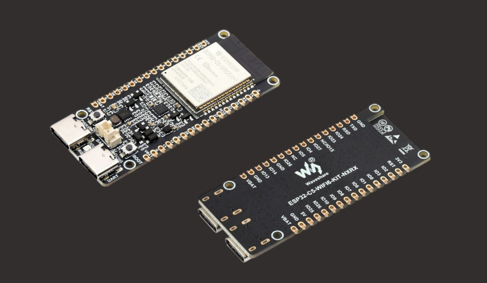

# Building IoT Devices with Embedded Rust - Intro

In this book, we learn about IoT development using Rust. For this, we will use the ESP32-C5. You will learn how IoT devices communicate over networks, work with sensors, exchange data with other systems using protocols such as MQTT, update firmware over the air (OTA), and work with other common IoT technologies. We will build hands-on examples to understand how the different pieces of an IoT system work together, and much more.

## Meet the Hardware

The ESP32-C5 is a RISC-V based System-on-Chip(SoC) from Espressif, with Wi-Fi 6 and Bluetooth Low Energy. It was announced in 2022 and entered mass production in 2025.



I am using the Waveshare ESP32-C5 WiFi 6 Kit N16R8 development board. You can use any ESP32-C5 development board from Espressif, such as the ESP32-C5-DevKitC-1, or from another manufacturer, as long as it uses the ESP32-C5 chip.

For the smoothest experience, I recommend using the same board or a board with a closely matching pinout and hardware configuration. If your board differs, you may need to adjust the pin assignments or other hardware-specific parts of the examples. We will go into more detail about the pins in the pinout section.

### Why ESP32-C5?

When it comes to IoT, the ESP32 family is one of the most popular choices for hobbyists and makers. There are already many books covering variants such as the original ESP32 and ESP32-C3.

For this book, I wanted to work with a newer ESP32 chip. I was initially considering the ESP32-C6 and ESP32-C5. One of the reasons I chose the ESP32-C5 was its support for 5 GHz Wi-Fi. The ESP32-C5 supports both 2.4 GHz and 5 GHz Wi-Fi 6, while the ESP32-C6 supports only 2.4 GHz Wi-Fi 6.

## How to read

You can access the mdBook here: https://iot.implrust.com/

or you can run locally

```sh
mdbook serve --open
```

## Support this project

You can support this book by starring this project on [GitHub](https://github.com/ImplFerris/iot-book) or sharing this book with others 😊

## License

The "Building IoT Devices with Rust" book(this project) is distributed under the following licenses:

* The code samples and free-standing Cargo projects contained within this book are licensed under the terms of both the [MIT License] and the [Apache License v2.0].
* The written prose contained within this book is licensed under the terms of the Creative Commons [CC-BY-SA v4.0] license.

[MIT License]: ./LICENSE-MIT
[Apache License v2.0]: ./LICENSE-APACHE
[CC-BY-SA v4.0]: ./LICENSE-CC-BY-SA
[MIT License Hosted]: https://opensource.org/licenses/MIT
[Apache License v2.0 Hosted]: http://www.apache.org/licenses/LICENSE-2.0
[CC-BY-SA v4.0 Hosted]: https://creativecommons.org/licenses/by-sa/4.0/legalcode


### Disclaimer:

The experiments and projects shared in this book have worked for me, but results may vary. I'm not responsible for any issues or damage that may occur while you're experimenting. Please proceed with caution and take necessary safety precautions.
