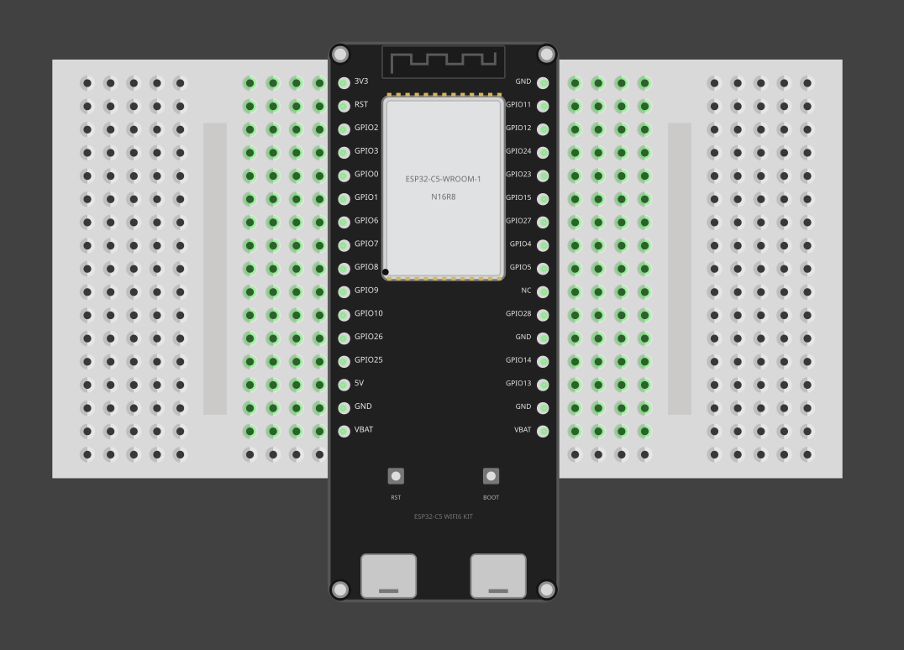

# Additional Hardware

In this section we will look at some of the extra hardware you might use along with the ESP32-C5.

# Breadboard

If you have worked with the ESP32 DevKit V1 board, or have seen my other book, you already know that the ESP32 DevKit V1 is too wide to fit on a standard breadboard. I solved this by using two mini breadboards.

The ESP32-C5 board is slightly narrower than the ESP32 DevKit V1, so it seems to fit on a standard breadboard. However, it leaves only one row of pins available on each side, which I don't feel comfortable working with.

So, I am using my two mini breadboard setup again. I place the ESP32-C5 development board between the two mini breadboards and connect the pins on each side to the respective breadboard.

