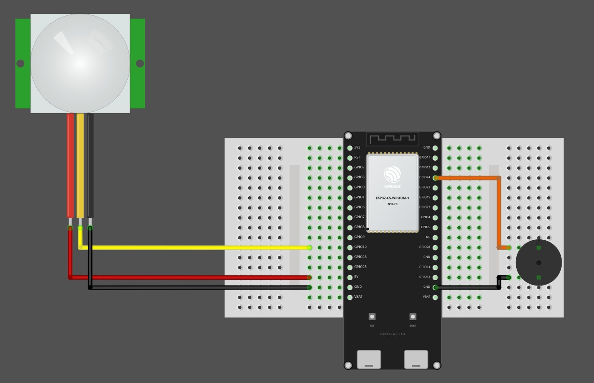

# Circuit

## Connecting PIR Sensor with ESP32

We will connect the HC-SR501 PIR sensor to the ESP32-C5 as shown below. The sensor is powered from the 5V pin, while its OUT signal is connected to GPIO 10. Whenever motion is detected, the sensor outputs a HIGH signal on GPIO 10.

<table style="margin-bottom:20px">
  <thead>
    <tr>
      <th>ESP32-C5 Pin</th>
      <th style="width: 250px; margin: 0 auto;">Wire</th>
      <th>PIR Sensor Pin</th>
    </tr>
  </thead>
  <tbody>
    <tr>
      <td>GPIO 10</td>
      <td style="text-align: center; vertical-align: middle; padding: 0;">
        

          

          

        

      </td>
      <td>OUT (middle pin)</td>
    </tr>
    <tr>
      <td>5V</td>
      <td style="text-align: center; vertical-align: middle; padding: 0;">
        

          

          

        

      </td>
      <td>VCC</td>
    </tr>
    <tr>
      <td>GND</td>
      <td style="text-align: center; vertical-align: middle; padding: 0;">
        

          

          

        

      </td>
      <td>GND</td>
    </tr>
  </tbody>
</table>
 

### Buzzer Pin Connection: 

We will connect the positive pin of the buzzer to GPIO 24, while the negative pin connects to GND. This allows us to control the buzzer and produce a sound when motion is detected.

<table style="margin-bottom:20px">
  <thead>
    <tr>
      <th>ESP32-C5 Pin</th>
      <th style="width: 250px; margin: 0 auto;">Wire</th>
      <th>Buzzer Pin</th>
    </tr>
  </thead>
  <tbody>
    <tr>
      <td>GPIO 24</td>
      <td style="text-align: center; vertical-align: middle; padding: 0;">
        

          

          

        

      </td>
      <td>Positive Pin</td>
    </tr>
    <tr>
      <td>GND</td>
      <td style="text-align: center; vertical-align: middle; padding: 0;">
        

          

          

        

      </td>
      <td>Negative Pin</td>
    </tr>
  </tbody>
</table>
