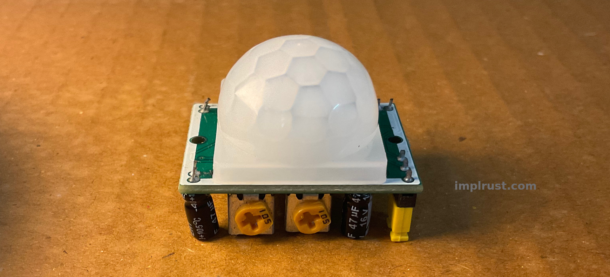
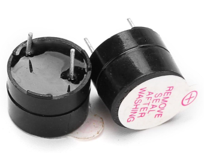

{{#title Create a Burglar Alarm with ESP32-C5 and Rust}}

# Create a Burglar Alarm with ESP32-C5 and Rust

Let's get straight into a practical project. We will create a simple burglar alarm using our first sensor, a PIR (Passive Infrared) sensor.

Imagine you want to know when someone enters a room while you are away. The PIR sensor can detect movement in the room, and the ESP32-C5 can respond. For this demo, we will turn on the RGB LED and sound a buzzer. In a real scenario, you might want to send an alert to your phone instead. Of course, a PIR sensor would not be enough on its own for a complete security system. You would typically use other sensors and cameras as well. But this project will give us a basic idea.

## Requirements

For this project, you will need:

- ESP32-C5 development board
- PIR motion sensor
- Jumper wires
- Active buzzer (optional)

### HC-SR501 PIR sensor module

The HC-SR501 is a PIR motion sensor module commonly used for motion detection in projects such as burglar alarms, automatic lighting, and home automation. It has a pyroelectric sensor and a dome-shaped Fresnel lens that help it detect changes in infrared radiation within its sensing area.

<figure >
  
</figure>

### Active Buzzer

If you don't have an active buzzer, you can leave it out of the circuit and skip the relevant parts of the code. If you decide to use a buzzer, make sure you get an active buzzer, not a passive buzzer. An active buzzer can produce a sound when you simply turn it on, which keeps things simple for this example.

<figure >
  
</figure>
