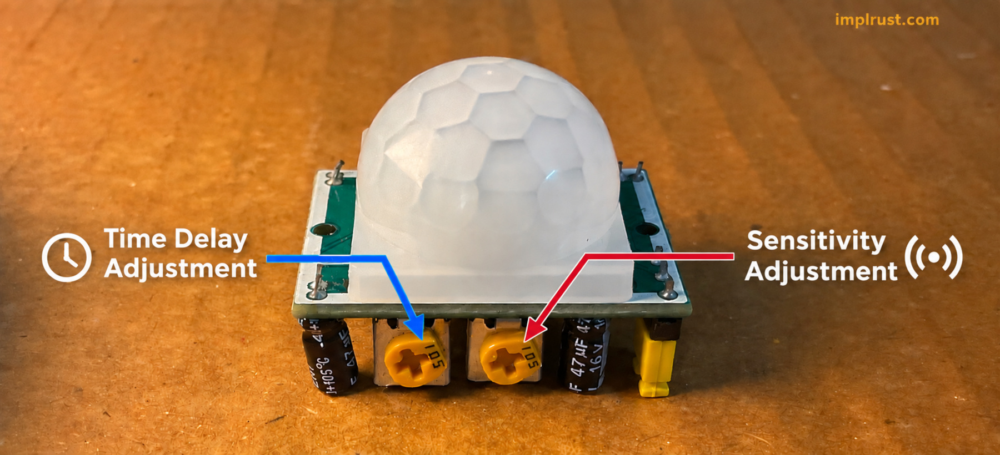
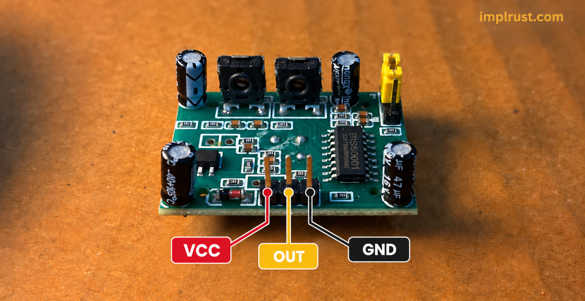
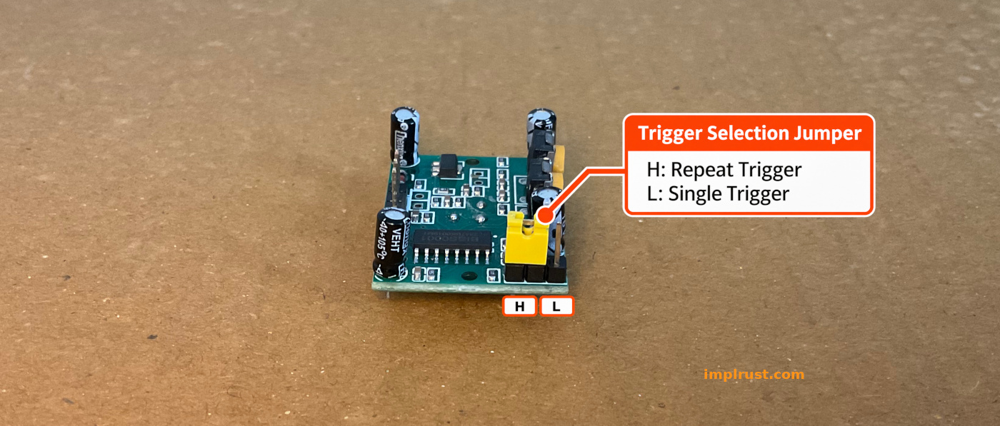
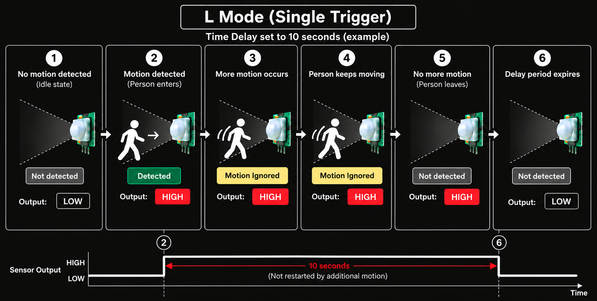
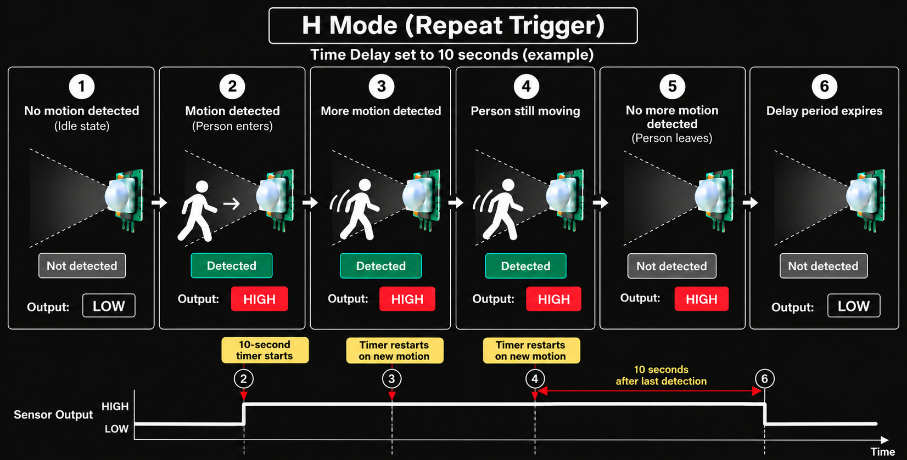

# HC-SR501 PIR Sensor Module

Everything around us emits infrared radiation based on its temperature, but warm objects such as people emit more infrared radiation than their surroundings. When a person moves across the sensor's field of view, the amount of infrared radiation reaching the sensor changes. The HC-SR501 detects this change and uses it to determine that motion has occurred.

## Sensitivity Adjustment

The sensitivity control adjusts the detection range of the PIR sensor. Turning the control changes how far away the sensor can detect motion, with the range typically reaching around 3 to 7 meters.

<figure >
  
</figure>

When you keep the PIR sensor with the dome pointing upward, the potentiometer on the right adjusts the sensitivity. Use a small screwdriver or a similar tool to turn the potentiometer.

## Time Delay Adjustment

The delay control determines how long the sensor's output remains active after motion is detected. The delay can typically be adjusted from around 3 seconds to 300 seconds (5 minutes). 

> [!NOTE]
>
> The sensor also has a short blocking period of a few seconds after the output goes LOW. During this period, it will not detect new motion.

## Pinout

The HC-SR501 has three pins: `VCC`, `OUT`, and `GND`. The sensor is powered through the `VCC` and `GND` pins. The middle pin is the digital output of the sensor. It produces a HIGH signal when motion is detected and a LOW signal when no motion is detected.

<figure >
  
</figure>

## Trigger Selection Jumper

The trigger selection jumper controls how the sensor responds when additional motion is detected during the configured delay period.

<figure >
  
</figure>

First, let's look at the `L` mode, which is simpler.

In `L` mode, the sensor uses a single trigger. Once motion is detected, the output goes HIGH and the module starts waiting for the configured delay period. If motion is detected again during this period, it does not restart the timer. The output goes LOW when the delay period expires.

<figure >
  
</figure>

For example, suppose the Time Delay is set to 10 seconds. When the module detects motion, the output goes HIGH and the module starts a 10-second delay. If the person moves again during those 10 seconds, the timer continues running from the original detection. After 10 seconds, the output goes LOW.

In `H` mode, the sensor uses a repeatable trigger. If motion is detected again while it is waiting, the module restarts the waiting period.

<figure >
  
</figure>

Let's say you have configured the Time Delay for 10 seconds. The module detects someone moving and starts waiting for 10 seconds. If the person moves again within that period, the module resets the waiting time and waits another 10 seconds from that detection. If no more motion is detected, the module waits for the full 10 seconds after the last detection before the output goes LOW.

For our project, we will use `H` mode to keep the output active when repeated motion is detected during the delay period.
