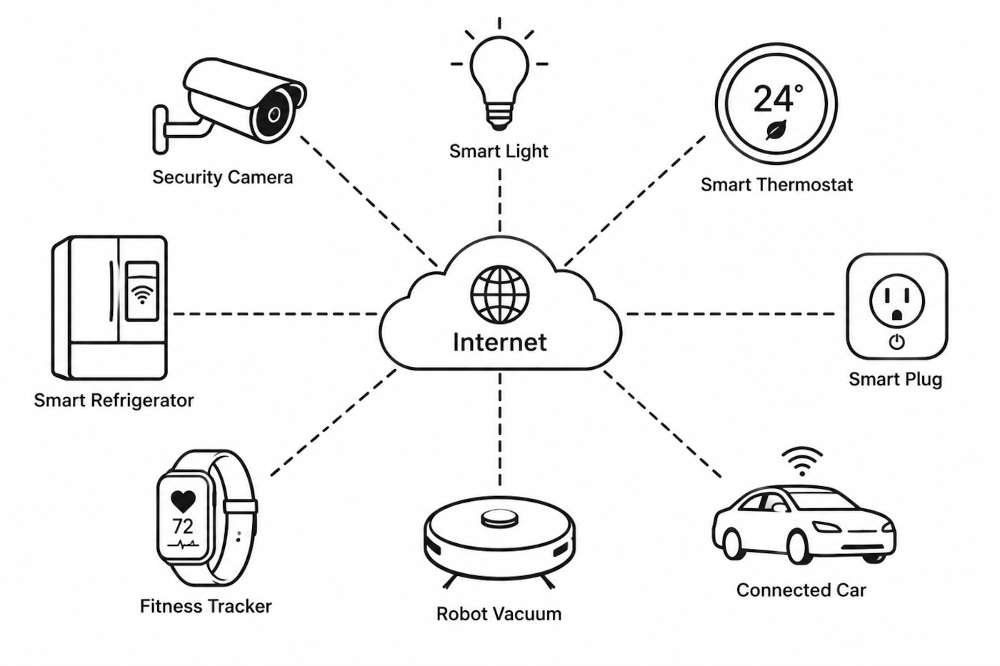

{{#title IoT (Internet of Things) with ESP32-C5 and Rust}}

# IoT

<figure>
  
  <figcaption style="text-align: center; padding-top: 5px">
    IoT Devices
  </figcaption>
</figure>

IoT stands for Internet of Things. IoT is a term used for devices that can sense or interact with the physical world and communicate that information over a network. This can be a small sensor sending temperature readings, a smart light receiving commands, or an industrial machine reporting its status.

The term is commonly attributed to Kevin Ashton. In an article he wrote in 2009, he mentioned that the phrase "Internet of Things" started as the title of a presentation he made at Procter & Gamble (P&G) in 1999. This does not mean that Ashton introduced the concept itself. People were already doing things that we would now describe as IoT, but without a name for it. The term brought these ideas together under one name and helped shape what we now call IoT.

For example, in the early 1980s, David Nichols and other students at Carnegie Mellon University built a system to monitor a Coca-Cola vending machine remotely. The system was connected to a computer on the ARPANET, allowing them to check whether drinks were available and which ones were cold.

Later, companies started bringing this idea into consumer products. In 2000, LG launched an Internet-connected refrigerator.

IoT devices are used in many areas. From smart home devices and wearables to industrial equipment, physical devices can collect information, communicate with other systems, and be controlled remotely.

## From IoT Devices to Smart Homes

IoT systems can range from a single connected device to systems where many devices communicate and work together.

For example, a temperature sensor connected to an ESP32 can collect temperature readings and send them over a network. A smart light can receive commands from a smartphone and turn on or off. Users can also interact with smart devices through voice assistants, smart speakers, and other interfaces.

As more devices become connected, they can also work together to automate everyday tasks. Imagine a morning routine in a smart home where the bedroom lights gradually turn on at a scheduled time, the curtains open, and the coffee maker starts preparing coffee. The thermostat can adjust the room temperature if needed. Later, when everyone leaves the house, the system can turn off the lights and other devices that are no longer needed.

These actions can be configured as routines or rules, allowing multiple devices to work together without requiring the user to control each device individually.

IoT systems can also be extended by combining them with artificial intelligence. For example, instead of following only predefined routines, an AI system could analyze data collected from the devices and learn patterns or preferences to make predictions and assist with decisions.

## ESP32 and IoT

When it comes to programming IoT devices, ESP32 is one of the first microcontrollers that comes to mind. Espressif introduced the ESP32 with built-in Wi-Fi and Bluetooth, making it well suited for building connected devices. 

Since then, Espressif has expanded the ESP32 family with different chips targeting different applications. The ESP32-C5 is one of the newer members of the family and the first ESP32 with dual-band 2.4 GHz and 5 GHz Wi-Fi 6.
