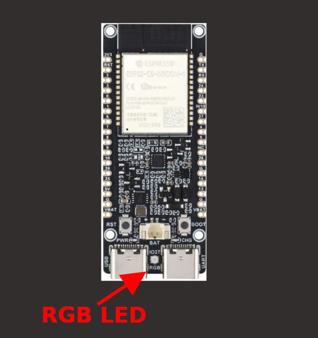

{{#title ESP32-C5 RGB LED Programming with Embedded Rust}}

# Onboard RGB LED

The ESP32-C5 board does not have a standard onboard LED. Instead, it has an addressable RGB LED connected to GPIO27. In a way, it is actually cool that our blinky program will be colorful. On the other side, for simple feedback where I use an onboard LED, I can't use that simple way.

<figure>
  
  <figcaption>ESP32-C5 Onboard RGB LED</figcaption>
</figure>

Let's generate the project with `esp-generate` in headless mode.

```sh
esp-generate --headless -o esp32c5 -o defmt -o esp32c5-wroom-1-psram rgb-led
```

## Dependencies

We will need two crates to work with the onboard RGB LED. The [`smart-leds`](https://docs.rs/smart-leds/latest/smart_leds/) crate provides a common interface for addressable LEDs such as WS2812 (NeoPixel) and APA102 (DotStar).

The [`esp-hal-smartled`](https://docs.rs/esp-hal-smartled/latest/esp_hal_smartled/) crate provides the ESP-HAL-specific implementation that uses the ESP32-C5's [RMT peripheral](https://docs.espressif.com/projects/esp-idf/en/v6.1/esp32c5/api-reference/peripherals/rmt.html) to generate the precise timing required by the WS2812B.

Add the following dependencies to your `Cargo.toml`:

```toml
esp-hal-smartled = "0.18.0"
smart-leds = "0.4.0"
```

## Additional Imports

We will add the necessary imports. In future exercises, I may not add instructions to import when they are obvious. I always provide the finished project link, so you can check the imports there as well.

```rust
use esp_hal::rmt::Rmt;
use esp_hal::time::Rate;
use esp_hal::delay::Delay;
use esp_hal_smartled::{RmtSmartLeds, buffer_size, color_order};
use smart_leds::{RGB8, SmartLedsWrite};
```

## Initialize RMT

First, let's initialize the RMT peripheral. We will use an 80 MHz frequency.

```rust
let freq = Rate::from_mhz(80);
let rmt = Rmt::new(peripherals.RMT, freq).unwrap();
```

## Configure the RGB LED

Next, we will configure the RMT channel to drive the WS2812B LED connected to GPIO27.

```rust
let mut led =
    RmtSmartLeds::<{ buffer_size::<RGB8>(1) }, _, RGB8, color_order::Grb>::new_with_memsize(
        esp_hal_smartled::WS2812_TIMING,
        rmt.channel0,
        peripherals.GPIO27,
        2,
        freq,
    )
    .unwrap();
```

The `WS2812_TIMING` provides the timing required by the WS2812B, while `color_order::Grb` specifies the order in which the LED expects the color values.

## Main loop

Now we can use the `write` method to send RGB values to the LED. Let's cycle through red, green, and blue with a 500 millisecond delay between each color.

```rust
 let delay = Delay::new();

loop {
    led.write([RGB8::new(255, 0, 0)]).unwrap();
    delay.delay_millis(500);

    led.write([RGB8::new(0, 255, 0)]).unwrap();
    delay.delay_millis(500);

    led.write([RGB8::new(0, 0, 255)]).unwrap();
    delay.delay_millis(500);
}
```


## Clone the existing project

You can clone (or refer) project I created and navigate to the `rgb-led` folder.

```sh
git clone https://github.com/ImplFerris/esp32c5-projects
cd esp32c5-projects/rgb-led/
```


## Run the program

Let's flash the firmware and run it. If everything works, you should see the RGB LED cycle through red, green, and blue.

```sh
cargo run --release
```

I will avoid repeating this step in future exercises. If an exercise requires additional input, such as an environment variable, I will include the required command at that point.
