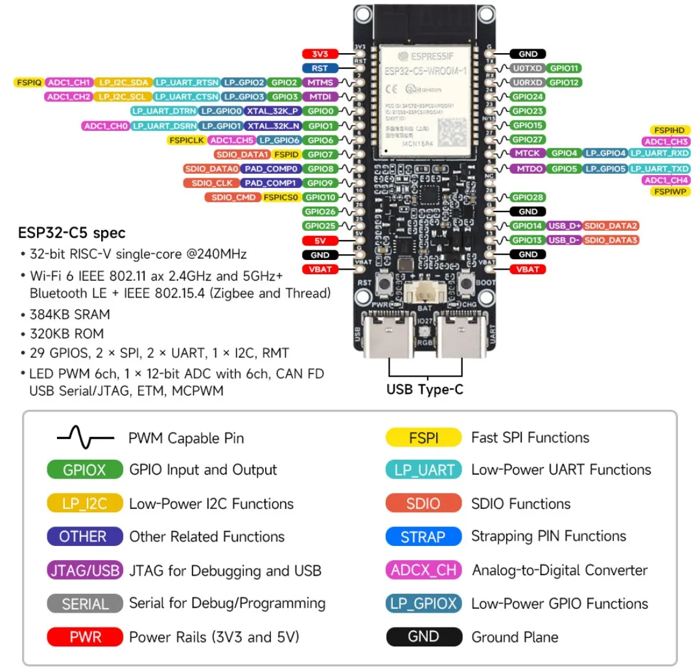

{{#title The pinout of the Waveshare ESP32-C5 board}}

# Pinout

The pinout of the Waveshare ESP32-C5-WIFI6-KIT board:

For the complete pin functions, refer to the [Waveshare ESP32-C5-WIFI6-KIT documentation](https://docs.waveshare.com/ESP32-C5-WIFI6-KIT) and the [Espressif ESP32-C5 documentation](https://docs.espressif.com/projects/esp-dev-kits/en/latest/esp32c5/esp32-c5-devkitc-1/user_guide.html).
