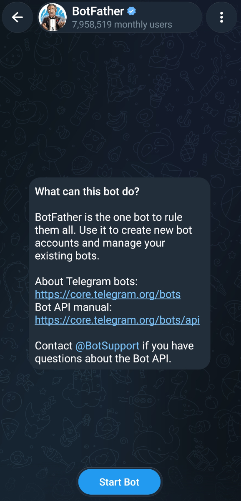
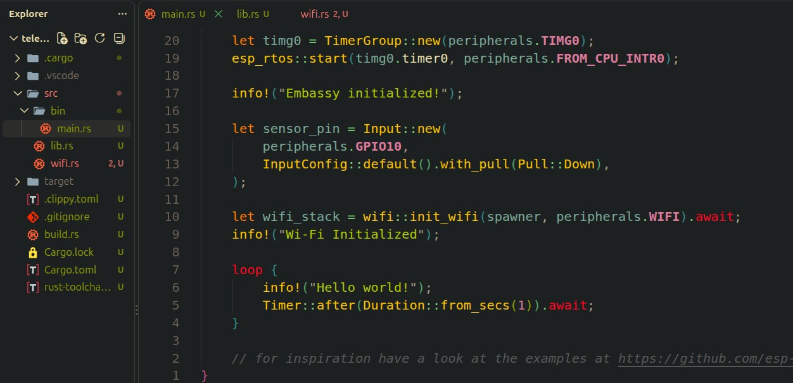

{{#title Send Telegram Notifications from ESP32-C5 Using Rust}}

# Telegram Notifications

We created the burglar alarm project, but currently, it only triggers the alarm and turns the onboard LED red. In a real scenario, we would mostly like to receive a notification on our phone.  In this chapter, we will use the Telegram Bot API to send notifications from the ESP32-C5 over Wi-Fi. This gives us a simple way to add remote notifications without introducing another protocol yet.

> [!Tip]
> If you get stuck or run into any import errors, you can refer to my project and navigate to the `telegram-notification` folder
>
> [ESP32-C5 Projects](https://github.com/ImplFerris/esp32c5-projects/tree/main/telegram-notification)

## Telegram API

The [Telegram Bot API](https://core.telegram.org/bots/api) is free to use and provides an HTTP-based interface for interacting with Telegram bots.  Before writing the code, we need to create a Telegram bot and get its bot token.

1. Open Telegram and search for **BotFather**. It will show a welcome message and a **Start** button. Click the **Start** button.

<figure>
  
  <figcaption style="text-align: center; padding-top: 5px">
    Telegram BotFather
  </figcaption>
</figure>


2. You will be presented with a list of options. You have to click `/newbot` for creating new bot.

3. It will ask you to enter a name for your bot.

4. Next, it will ask for a username for your bot. The username must end with `bot`, such as `my_esp32_bot`.

5. It will create the bot and provide a **token** to access the HTTP API.

6. Save this token somewhere secure. Anyone with the token can control your bot, so do not share it publicly.

We will use this token later when making requests to the Telegram Bot API.

### Get Chat ID

We also need the **chat ID** where the bot will send messages.

1. Open the bot you created and click **Start** to start a conversation with it.

2. Send any message to the bot, such as Hello.

3. Then, use the `curl` to call the `getUpdates` API, replacing `<BOT_TOKEN>` with the token you received before:

```bash
curl "https://api.telegram.org/bot<BOT_TOKEN>/getUpdates"
```

4. The response will contain information about the message you sent. Look for the `chat` object and its `id` field:

```json
{
  ..
  "chat": {
    "id": 123456789, // Example ID
    ...
  }
}
```

5. The number in the `id` field is your chat ID.


## Project Setup

Run the following command to create the `telegram-notification` project:

```sh
esp-generate --headless \
  -o esp32c5 \
  -o esp32c5-wroom-1-psram \
  -o unstable-hal \
  -o alloc \
  -o embassy \
  -o wifi \
  -o defmt \
  telegram-notification
```

Add the following dependencies to your `Cargo.toml`:

```toml
reqwless = { git = "https://github.com/drogue-iot/reqwless", rev = "b761705cc654e6f31bc064183e219aa09b33968a", default-features = false, features = [
  "defmt",
  "embedded-tls",
  "rsa",
] }
```

The Telegram Bot API uses HTTPS, so we need to enable the `embedded-tls` and `rsa` features in `reqwless`.

At the time of writing, the latest `reqwless` version was `0.14.0`. I faced two issues. I solved the first issue by adding the `der` dependency manually. But when I tried to verify the server certificate, I got an `InvalidSignatureScheme` error. So instead, I decided to use the latest code from the GitHub repository. To make it reproducible, we pin the dependency to a specific commit rather than automatically using the latest commit.

Enable `dns` feature in `embassy-net`:

```toml
embassy-net = { version = "0.9.1", features = [
  "defmt",
  "dhcpv4",
  "medium-ethernet",
  "tcp",
  "udp",
  "dns", # <= Addition
] }
```
## Project Base

Next, copy the PIR sensor setup and detection code from the previous burglar alarm chapter. We do not need the buzzer or RGB LED code for this project.

```rust
// just this: 
let sensor_pin = Input::new(
    peripherals.GPIO10,
    InputConfig::default().with_pull(Pull::Down),
);
```

Since the ESP32-C5 needs an Internet connection to communicate with Telegram, we will use Wi-Fi. So, copy the Wi-Fi module and Wi-Fi initialization code from the previous chapters.

Once you have copied both, the base setup should be something like this:

<figure>
  
  <figcaption style="text-align: center; padding-top: 5px">
    Project Base Setup
  </figcaption>
</figure>

Now create a new module called `telegram.rs`.  We will use this module to work with the Telegram API.

Your project structure should now look like this:

```text
├── src
│   ├── bin
│   │   └── main.rs
│   ├── lib.rs
│   ├── telegram.rs
│   └── wifi.rs
```

## Imports

Add the necessary imports to the `telegram` module:

```rust
use defmt::{error, info};

use embassy_net::Stack;
use embassy_time::{Duration, Instant, with_timeout};

use embassy_net::{dns::DnsSocket, tcp::client::TcpClient};
use reqwless::client::{HttpClient, TlsConfig, TlsVerify};
use reqwless::request::Method;

use alloc::format;
use reqwless::headers::ContentType;
use reqwless::request::RequestBuilder;

use crate::mk_static;

extern crate alloc;
```


## TCP Configuration

We will define a few constants used by the TCP client. We set the maximum number of concurrent connections to 1, and the transmit and receive buffer sizes to 1500 bytes. Finally, we create an alias for the TCP client state:

```rust
// TCP Config
const MAX_CONCURRENT_CONNECTIONS: usize = 1;
const TCP_TX_BUFFER_SIZE: usize = 1500;
const TCP_RX_BUFFER_SIZE: usize = 1500;

type TcpClientState = embassy_net::tcp::client::TcpClientState<
    MAX_CONCURRENT_CONNECTIONS,
    TCP_TX_BUFFER_SIZE,
    TCP_RX_BUFFER_SIZE,
>;
```

## Telegram Configuration

We will load the Telegram token and chat ID from environment variables and put them into constants. We also define a notification interval to control how much time to wait between Telegram messages. Without this, if there is an issue in our logic or some other problem, we might end up sending too many Telegram messages. We also set the API request timeout to 10 seconds. You can increase this value if needed.

```rust
const TELEGRAM_TOKEN: &str = env!("TELEGRAM_TOKEN");
const CHAT_ID: &str = env!("TELEGRAM_CHAT_ID");
const NOTIFICATION_INTERVAL: Duration = Duration::from_secs(120);
const REQUEST_TIMEOUT: Duration = Duration::from_secs(10);
```

## Telegram Error Handling

The `reqwless` can return errors when a request fails, but we also need to handle errors returned by the Telegram API itself, such as a 403 status code. For example, you may get a 403 error if the chat ID is incorrect or you have not started a conversation with the bot. We create a custom error type to handle both types of errors.

```rust
#[derive(Debug)]
enum TelegramError {
    Http(reqwless::Error),
    Status(u16),
}

impl From<reqwless::Error> for TelegramError {
    fn from(e: reqwless::Error) -> Self {
        TelegramError::Http(e)
    }
}
```

## Telegram Client

We will create a struct for the Telegram client with the following fields:

```rust
pub struct TelegramClient {
    stack: Stack<'static>,
    tcp_state: &'static TcpClientState,
    last_sent: Option<Instant>,

    // Buffers
    tls_rx: [u8; 16_640], // 16640 required for the TLS read buffer
    tls_tx: [u8; 4096],
    http_rx: [u8; 4096],
}

impl TelegramClient {
    pub fn new(stack: Stack<'static>) -> Self {
        Self {
            stack,
            tcp_state: mk_static!(TcpClientState, TcpClientState::new()),
            last_sent: None,

            // Buffers
            tls_rx: [0; 16_640],
            tls_tx: [0; 4096],
            http_rx: [0; 4096],
        }
    }

    //...
    // We will define a few more functions here
}
```

The `tls_rx` and `tls_tx` are buffers used by TLS, while `http_rx` is the HTTP receive buffer. We also have the `last_sent` field to track when we last sent a Telegram message.


## Sending a Telegram Message

Most of the code here is similar to what we used in the Access a Website section. This time, however, we need TLS because the Telegram API uses HTTPS. Unlike a desktop machine, the ESP32-C5 does not have a system certificate store that we can use. To keep things simple, we will initially disable TLS certificate verification. This is insecure and makes the connection vulnerable to a MITM (man-in-the-middle) attack. In the next section, we will download the Telegram certificate and use it to verify the server.

```rust
async fn send(&mut self, text: &str) -> Result<(), TelegramError> {
    let rng = esp_hal::rng::Rng::new();
    let tls_seed = {
        let mut bytes = [0u8; 8];
        rng.read(&mut bytes);
        u64::from_le_bytes(bytes)
    };

    let tls_config = TlsConfig::new(
        tls_seed,
        &mut self.tls_rx,
        &mut self.tls_tx,
        TlsVerify::None, // Insecure but ok for now
    );

    let tcp_client = TcpClient::new(self.stack, self.tcp_state);
    let dns_client = DnsSocket::new(self.stack);
    let mut client = HttpClient::new_with_tls(&tcp_client, &dns_client, tls_config);

    let url = format!("https://api.telegram.org/bot{}/sendMessage", TELEGRAM_TOKEN);
    let body = format!(r#"{{"chat_id":"{}","text":"{}"}}"#, CHAT_ID, text);

    let mut request = client
        .request(Method::POST, &url)
        .await?
        .body(body.as_bytes())
        .content_type(ContentType::ApplicationJson);

    let response = request.send(&mut self.http_rx).await?;

    let status = response.status.0;
    let resp_body = response.body().read_to_end().await?;
    let resp_text = core::str::from_utf8(resp_body).unwrap_or("invalid UTF-8");

    if status != 200 {
        error!("Telegram error body: {}", resp_text);
        return Err(TelegramError::Status(status));
    }

    info!("Telegram response: {}", resp_text);

    Ok(())
}
```

The Telegram API endpoint for sending a message is "sendMessage". It expects a POST request with a JSON body containing the chat ID and message. After receiving the response, we check the HTTP status code. If it is not `200`, we consider the request an error.

We are using `format!` to build the JSON body because the request is simple. If the JSON becomes more complicated or we need to parse the JSON response, we will need to use a crate such as `serde`.

## Notification Logic

First, we check how much time has passed since the last message was sent. If the waiting time has not passed, we skip sending the message. We also set a timeout for the request so it does not wait forever. Finally, we handle the result and update `last_sent` only when the message is sent successfully.

```rust
pub async fn notify(&mut self, text: &str) {
    if let Some(t) = self.last_sent {
        if t.elapsed() < NOTIFICATION_INTERVAL {
            info!("Cooldown active, skipping");
            return;
        }
    }

    match with_timeout(REQUEST_TIMEOUT, self.send(text)).await {
        Ok(result) => self.handle_result(result),
        Err(_) => {
            error!("Telegram request timed out");
        }
    }
}

fn handle_result(&mut self, result: Result<(), TelegramError>) {
    match result {
        Ok(()) => {
            info!("Message sent successfully");
            self.last_sent = Some(Instant::now());
        }
        Err(TelegramError::Http(e)) => {
            error!("HTTP request failed: {:?}", e);
        }
        Err(TelegramError::Status(s)) => {
            error!("Telegram returned HTTP status: {}", s);
        }
    }
}
```

## Start Monitoring

We create the Telegram client and wait for 60 seconds to allow the PIR sensor to warm up. In the previous example, we used an `if` statement to check whether the sensor pin was high and then took action. This time, we use the `wait_for_high` function to wait for the pin to go high. Then, we send the Telegram notification. Once the notification is sent, we wait for the sensor pin to go low again.

```rust
let mut telegram = TelegramClient::new(wifi_stack);

Timer::after(Duration::from_secs(60)).await; // PIR warm-up
info!("Monitoring...");

loop {
    sensor_pin.wait_for_high().await;
    info!("Motion detected!");

    telegram.notify("Motion Detected").await;

    sensor_pin.wait_for_low().await;
}
```

## Run the Program

Apart from the Wi-Fi credentials, we also need to pass the Telegram token and chat ID as environment variables.

```sh
SSID='YOUR_WIFI_NAME' \
PASSWORD='YOUR_WIFI_PASSWORD' \
TELEGRAM_TOKEN='YOUR_BOT_TOKEN' \
TELEGRAM_CHAT_ID='YOUR_CHAT_ID' \
cargo run --release
```

If you find this command too long, you can set the environment variables before running the program and then simply run `cargo run --release`

Wait for the PIR sensor to warm up and then make a movement in front of the sensor. If everything works as expected, you should receive a message in Telegram.
