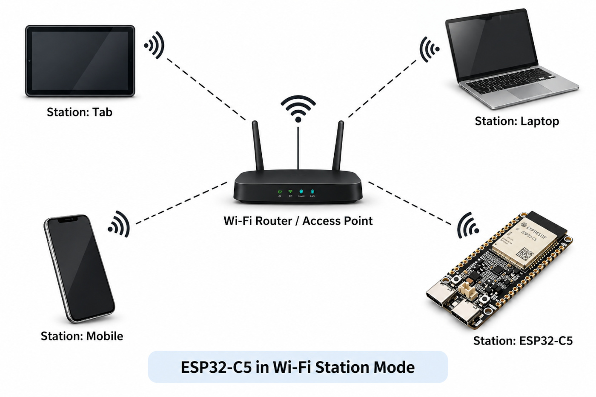
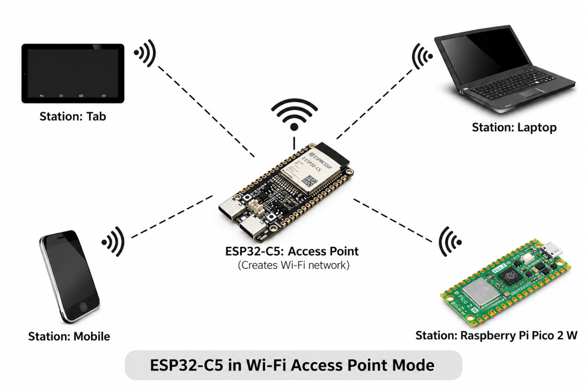

{{#title ESP32-C5 Wi-Fi Programming with Rust}}

# Wi-Fi

Wi-Fi plays a significant role in the IoT ecosystem. It allows devices to connect to wireless networks and communicate with other devices and Internet-based services. For example, our device can collect data from sensors and send it to a server over Wi-Fi, or receive commands from a remote application. 

The ESP32-C5 supports dual-band Wi-Fi 6 (802.11ax), operating on both the 2.4 GHz and 5 GHz bands. It is also compatible with earlier Wi-Fi standards, making it possible to connect to a wide range of existing wireless networks.

The 2.4 GHz band generally provides better range, while the 5 GHz band can provide higher performance with less congestion in many environments. The ESP32-C5's dual-band capability allows an application to use either band depending on the requirements of the network and device.

## Wi-Fi Modes

The ESP32-C5 can operate in different Wi-Fi modes depending on how it communicates with other devices.

- In Station (STA) mode, the ESP32-C5 connects to an existing Wi-Fi network. 
- In Access Point (AP) mode, it creates its own Wi-Fi network that other devices can connect to. 

The ESP32-C5 can also operate in Station + Access Point (STA+AP) mode, where it connects to an existing network while simultaneously providing its own Wi-Fi network.

## Station Mode

In Station mode (STA), the ESP32-C5 connects to an existing Wi-Fi network through an access point, such as the Wi-Fi router in your home. The ESP32-C5 acts as a Wi-Fi client, similar to a mobile phone, tablet, or laptop. Once connected, it can communicate with other devices on the network and access services available through the network.

<figure >
  
</figure>

## Access Point Mode

In Access Point mode (AP), the ESP32-C5 creates its own Wi-Fi network, allowing other devices such as laptops, tablets, smartphones, and other microcontrollers to connect to it. Unlike Station mode, the ESP32-C5 does not connect to an existing Wi-Fi network; instead, it acts as the access point for other devices.

<figure >
    
</figure>
